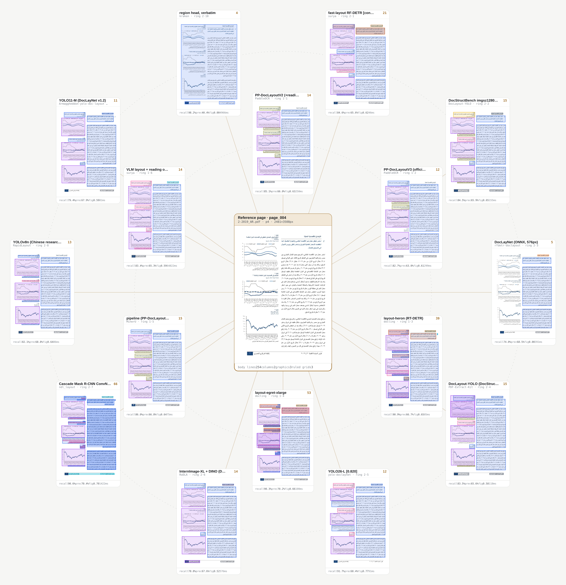

# DLA Suite

Run and compare 58 document layout analysis configurations across 23 model repositories over your documents and evaluate thier results.

Each page is rendered once at 300 dpi and passed to every selected model in its own isolated
environment. The output is a single self-contained HTML file: every model's regions drawn around
your page, plus a side-by-side view of any model against the page.

```bash
make build     # container image
make setup     # environments + weights
make up        # http://localhost:8080
```

<p align="center">
  
</p>

<p align="center">
  <sub>One page of a real financial report through the <code>balanced</code> profile. The page sits at the
  centre; every model holds a fixed angular position so you can track it across pages.</sub>
</p>

## Why it exists

Layout models are trained on different datasets with different class vocabularies, and published
benchmarks rarely tell you how any of them behave on *your* documents. Running them yourself is
awkward because their dependencies conflict — Docling wants current `transformers`, PDF-Extract-Kit's
vendored LayoutLMv3 wants an old one, detectron2 pins `iopath<0.1.10`, RoDLA needs mmcv 1.x, M2Doc
needs mmcv 2.x. This puts each one in its own virtualenv behind a common adapter interface, so
comparing them is a config change instead of a week of dependency work.

## Requirements

Docker with Compose. An NVIDIA GPU for most models; the `cpu` profile runs without one. About 15 GB
of disk for the `balanced` profile, 45 GB for `full`.

## Usage

```bash
cp .env.example .env                      # port, profile, page cap, HF cache location
make setup SETUP_PROFILE=fast             # smaller install
make analyse FILE=doc.pdf PROFILE=fast    # no UI, any path
make corpus DIR=pdfs/ WORKSPACE=out       # a whole directory into one workspace
make list                                 # what is registered and what is installed
make doctor                               # resolved paths, GPU visibility
make test                                 # end-to-end smoke test
make validate WORKSPACE=out               # decide every page of a workspace
```

Inside the container:

```bash
python -m core.pipeline --input doc.pdf --profile balanced
python -m core.pipeline --workspace data/jobs/<id> --resume
python -m core.runner --systems docling.heron surya.v2_layout --force
```

HTTP API at `/api/docs`: `POST /api/jobs`, `GET /api/jobs/{id}`, `GET /api/jobs/{id}/report`,
`GET /api/jobs/{id}/bundle`.

## Models

58 configurations across 23 repositories. `harness/registry.yaml` is the source of truth; a model is
one setup script, one adapter and one registry entry.

| Repository | Configs | What it contributes |
|---|---|---|
| [Docling](https://github.com/docling-project/docling) | 3 | RT-DETR layout, three presets, 11-class DocLayNet vocabulary |
| [Surya](https://github.com/datalab-to/surya) | 3 | Fast detector plus a VLM layout model, with reading order |
| [PaddleOCR](https://github.com/PaddlePaddle/PaddleOCR) | 4 | PP-DocLayout family; V3 emits instance masks |
| [MinerU](https://github.com/opendatalab/MinerU) | 2 | Pipeline backend with reading order; VLM backend registered |
| [DocLayout-YOLO](https://github.com/opendatalab/DocLayout-YOLO) | 4 | DocLayNet / D4LA / DocStructBench, with and without DocSynth300K pretraining |
| [PDF-Extract-Kit](https://github.com/opendatalab/PDF-Extract-Kit) | 2 | DocLayout-YOLO and LayoutLMv3 as packaged upstream |
| [yolo-doclaynet](https://github.com/ppaanngggg/yolo-doclaynet) | 3 | YOLOv8-X / v12-L / YOLO26-L on DocLayNet |
| [Armaggheddon/yolo-document-layout](https://huggingface.co/Armaggheddon/yolo26-document-layout) | 2 | YOLO11-M and YOLO26-M on DocLayNet v1.2 — same data, two architectures |
| [YOLOv11-Document-Layout-Analysis](https://github.com/moured/YOLOv11-Document-Layout-Analysis) | 1 | A third independent DocLayNet YOLO |
| [RapidLayout](https://github.com/RapidAI/RapidLayout) | 5 | ONNX PicoDet on CDLA and PubLayNet, plus [360LayoutAnalysis](https://github.com/360AILAB-NLP/360LayoutAnalysis) YOLOv8n |
| [Layout-Parser](https://github.com/Layout-Parser/layout-parser) | 3 | detectron2 baselines on PubLayNet and PRImA |
| [unilm](https://github.com/microsoft/unilm) | 2 | DiT and LayoutLMv3 on PubLayNet |
| [VGT](https://github.com/AlibabaResearch/AdvancedLiterateMachinery) | 4 | Vision Grid Transformer; consumes the PDF text layer |
| [M2Doc](https://github.com/johnning2333/M2Doc) | 4 | DINO-4scale with multilingual text-line fusion |
| [RoDLA](https://github.com/yufanchen96/RoDLA) | 1 | InternImage-XL with DCNv3 plus a DINO head |
| [SwinDocSegmenter](https://github.com/ayanban011/SwinDocSegmenter) | 1 | Swin-L + MaskDINO, instance masks |
| [DocSAM](https://github.com/xhli-git/DocSAM) | 5 | Mask2Former with class names as prompts, instance masks |
| [ndl_layout](https://github.com/ndl-lab/ndl_layout) | 2 | Cascade Mask R-CNN trained on Japanese material, instance masks |
| [kraken](https://github.com/mittagessen/kraken) | 3 | Baseline segmentation with an explicit text-direction setting |
| [RF-DETR-DocLayout](https://github.com/roboflow/rf-detr) | 1 | RF-DETR on DocLayNet, ONNX |
| [Dolphin](https://github.com/bytedance/Dolphin) | 1 | Stage-1 layout of a parsing VLM |
| [Eynollah](https://github.com/qurator-spk/eynollah) | 1 | Pixelwise segmentation to PAGE-XML |
| [olmOCR](https://github.com/allenai/olmocr) | 1 | Anchor/layout output of a parsing VLM |

Weights come from each project's own release. Licences differ and several are stricter than this
repository — the Ultralytics-derived YOLO checkpoints are AGPL-3.0, some parsers ship custom terms.
Check the licence of anything you deploy.

## Profiles

A profile is a list of system ids in `config/profiles/`.

| Profile | Models | Use |
|---|---|---|
| `fast` | 5 | Quick look, one model per family |
| `balanced` | 16 | Default. Every competitive family plus masks, reading order and RTL segmentation |
| `full` | 54 | Everything evaluable. Minutes per page |
| `cpu` | 7 | No GPU required |
| `segmentation` | 6 | Only models that emit instance masks |

## How it works

Thirteen stages, each a separate process with `DLA_WORKSPACE` set to the job directory:

`inventory` → `select` → `reference` → `run` → `metrics` → `consensus` → `evidence` → `ensemble` →
`ratings` → `validate` → `manifest` → `package` → `report`

A job is a directory under `data/jobs/`. Its status is `status.json`, its result is
`reports/index.html`, and its inputs and intermediate outputs sit beside them. No database, no queue
broker: restarting the server loses nothing.

Models never share a process with the harness. The runner writes a job JSON, starts
`assets/envs/<env>/bin/python harness/adapters/<adapter>.py`, and records the outcome. A model that
crashes is recorded as `crashed`, `timed_out` or `env_missing`; the batch continues.

**Metrics.** There is no human ground truth for an arbitrary PDF, so nothing here is mAP. For
born-digital pages the content stream states exactly where glyphs, images, vector art and ruling
lines are, and that is used as a geometric reference: text recall, text precision, spill, line
capture, figure IoU, column bleed. Scanned pages have no text layer, so those columns are empty and
the visual comparison stands on its own.

**Consensus** is deduplicated by repository: three configurations of one project vote once, keyed on
the registry's `repo` field.

More detail in [docs/architecture.md](docs/architecture.md).

## Validation

Layout quality is easy to judge by eye and hard to judge at scale. A pipeline ingesting a corpus into a vector index, an object store and a table database makes one decision per page, thousands of times over, and a bad decision does not look like a lower score. It looks like a paragraph absent from the index, a table whose rows arrive interleaved, or a figure written into the text store. Those failures are silent: nothing raises, nothing logs, and a corpus-level recall average hides all of them.

Verifying that with a held-out set means human labels, which do not exist for an arbitrary PDF and cost weeks to create. This package takes the other route.

`validate` uses the reference the metrics already use: a born-digital PDF states in its own content stream where every glyph, image, vector drawing and ruling line sits. Each
check asks whether a specific thing that would corrupt downstream data has happened, and the stage returns a verdict per page.

| Decision | Meaning |
|---|---|
| `accept` | write it downstream |
| `escalate` | a reviewer sees it, with the reason in words and the regions to open |
| `defer` | this pipeline reads born-digital pages and that page is not one |
| `reject` | off by default: rejecting a page needs a calibrated score, and that needs labels |

A page escalates when a blocking check fires *or* when a blocking check could not run — an
unavailable check is never recorded as a pass. Findings on one defect are grouped, so a reviewer gets one task per defect rather than one per check.

### What it checks

| Family | Asks | Checks | Blocking | Findings |
|---|---|---|---|---|
| C1 coverage | is content missing from every region? | 7 | 5 | 14.4% |
| C2 boundaries | do region edges cut through text lines? | 2 | 0 | 32.3% |
| C3 columns | are columns resolved, or merged and straddled? | 3 | 1 | 2.4% |
| C4 order | is the reading order valid on its own terms? | 6 | 3 | 34.0% |
| C5 duplication | is anything written to a store twice? | 2 | 0 | 18.9% |
| C6 buckets | will each region reach the right store? | 5 | 3 | 11.8% |
| C7 sanity | is the layout malformed on its own terms? | 4 | 2 | 8.5% |
| C8 document | is this page unlike the rest of its document? | 5 | 0 | 7.1% |

Findings per (system, page) pair over 424 pairs — 120 pages sampled uniformly at random from 23 documents, scored against four systems. A finding is not an escalation: only blocking checks escalate a page. Two of the 14 are blocking or not depending on `policy.discard`, since deleting a paragraph by mislabelling it a running header is recoverable if discarded regions are archived and permanent if they are dropped.

### What it decides

| System | Accept | Escalate | Defer |
|---|---|---|---|
| `docling.heron` | 73.3% | 15.0% | 11.7% |
| `dly.docstructbench_1280` | 70.8% | 17.5% | 11.7% |
| `ndl.layout` | 65.8% | 22.5% | 11.7% |
| `paddleocr.pp_doclayoutv2` | 65.0% | 23.3% | 11.7% |

Defer is a property of the corpus rather than the model: the same 14 pages have no usable text layer for everyone. 5 are scans; the other 9 are born-digital files whose glyphs were converted to vector outlines, so their text does not extract.

### Using it

Output lands in `<workspace>/validation/`:

```
decisions/<system>.json   one record per page, full evidence
queue.json                escalations as reviewer tasks, typed E1-E7
deferred.json             pages awaiting a path this pipeline does not have yet
summary.json              the per-system mix, also embedded in the report
```

```bash
make validate WORKSPACE=benchmark CORPUS=data/corpus_flat
make validate-selftest                    # pages built in memory, no corpus needed
```

One page at a time, from Python:

```python
from validation.api import decide_page
d = decide_page("report.pdf", 4, regions)     # regions in 300 dpi pixel space
d["decision"], d["task"], d["findings"]
```

`harness/validation/` depends on PyMuPDF, numpy, PyYAML and Pillow and on nothing else in this
repository, so it also ships alone — 314 MB against the suite image's 16 GB, no GPU, no weights:

```bash
make validation-image
make validate-page PDF=doc.pdf PAGE=4 LAYOUT=regions.json
```

The escalation rate is a review cost. It is fitted to bound how often the checks fire, and says nothing about how often an accepted page is wrong — that needs annotated pages.
[harness/validation/README.md](harness/validation/README.md) has the check list, the thresholds and the known gaps.

## Configuration

`config/dla.yaml`. Every key has an environment override:

| Key | Variable |
|---|---|
| `paths.workspace` | `DLA_WORKSPACE` |
| `run.profile` | `DLA_RUN_PROFILE` |
| `selection.max_pages` | `DLA_SELECTION_MAX_PAGES` |
| `server.port` | `DLA_SERVER_PORT` |
| `report.template` | `DLA_REPORT_TEMPLATE` |

`DLA_CONFIG` points at a different YAML file entirely.

## Adding a model

Three files, no image rebuild:

1. `harness/setup/<env>.sh` — create the virtualenv and fetch weights
2. `harness/adapters/<adapter>.py` — load the model, emit regions per page
3. an entry in `harness/registry.yaml`

Add a mapping table to `harness/core/taxonomy.py` if the class names are new. See
[docs/adding-a-model.md](docs/adding-a-model.md).

## Layout

```
config/            dla.yaml and run profiles
docker/            Dockerfile, compose, entrypoint
docs/              architecture, adding a model
harness/core/      pipeline, ingestion, reference, metrics, report generation
harness/validation/  page checks, the decision layer, the escalation queue
harness/adapters/  one per model family
harness/setup/     one per environment
harness/report/    report shell and viewer
harness/app/       FastAPI service and UI
samples/           gitignored: put input PDFs here
assets/            gitignored: virtualenvs, weights, cloned repositories
data/              gitignored: uploads and job workspaces
```

## Licence

Apache-2.0. Model weights are not covered by it; see the table above.
